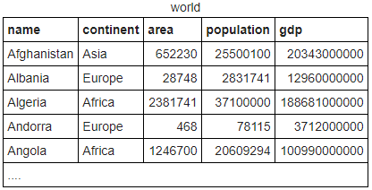

# SQLZoo-answers
My answers for [SQLZoo](https://sqlzoo.net) tutorials questions 

## Sections:
1. [SELECT basics](#select-basics)
2. [SELECT from WORLD](#select-from-world)
3. [SELECT from NOBEL (harder questions)](#select-from-nobel)
4. [NESTED SELECT](#nested-select)
5. [SUM and COUNT](#sum-and-count)
6. [JOIN](#join)
7. [More JOIN](#more-join)
8. [Using NULL](#using-null)
9. [Self JOIN](#self-join)

## SELECT basics


Some simple queries to get you started

1.1 Modify it to show the population of Germany
```sql
  SELECT population FROM world
    WHERE name = 'Germany'
```
1.2 Modify it to show the population of Russia
```sql
  SELECT population FROM world
    WHERE name = 'Russia'
```

2.1 Show the name and the population for 'Sweden', 'Norway' and 'Denmark'.
```sql
SELECT name, population FROM world
  WHERE name IN ('Sweden', 'Norway', 'Denmark');
```
2.2 Show the name and the population for 'Brazil', 'Russia', 'India' and 'China'.
```sql
SELECT name, population FROM world
  WHERE name IN ('Brazil', 'Russia', 'India', 'China');
```

3.1 Shows countries with an area of 250,000-300,000 sq. km.
```sql
SELECT name, area FROM world
  WHERE area BETWEEN 250000 AND 300000
```
3.2 Modify it to show the country and the area for countries with an area between 200,000 and 250,000.
```sql
SELECT name, area FROM world
  WHERE area BETWEEN 200000 AND 250000
```